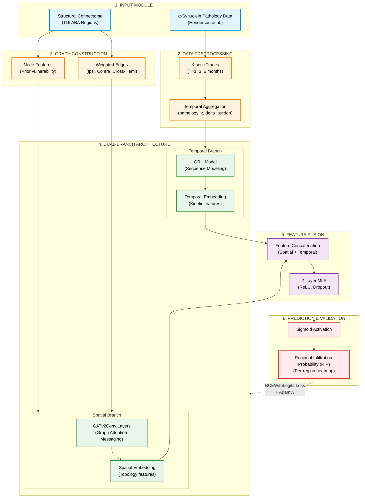

# RIP-GNN Methodology Diagram

This diagram maps precisely to the 6 primary steps of the RIP-GNN experimental pipeline. You can use this Mermaid.js chart directly in Markdown, Notion, or export it to an SVG/PNG for your IEEE MERCon paper.

